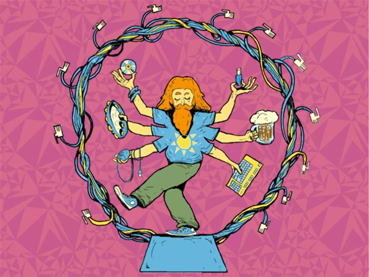

# Факты обо мне:
1. Весёлый
2. Общительный
3. Прямолинейный
4. Верный
5. Сообразительный

> [!TIP]
> Три пути ведут к знанию: путь размышления — это путь самый благородный, путь подражания — это путь самый лёгкий и путь опыта — это путь самый горький.

